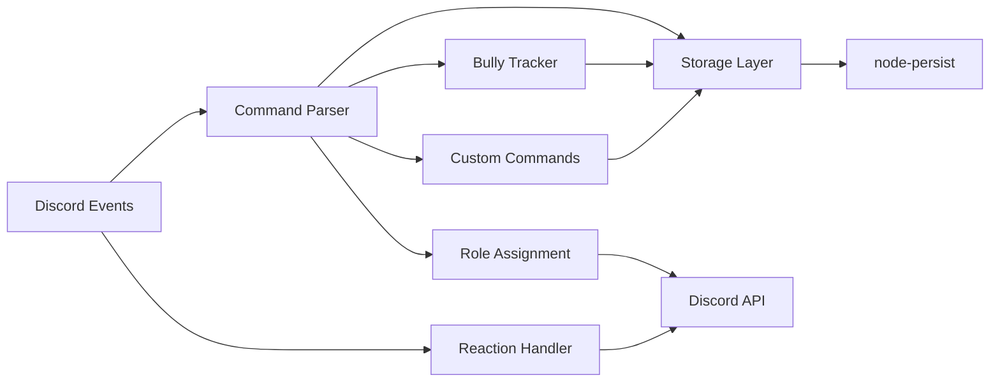

````markdown
# Architecture



The bot listens to Discord events, parses commands, handles reactions, interacts with storage, and uses the Discord API to respond. Key components include:

- **Command Parser**: Processes `!addcommand`, `!removecommand`, `!help`, and bully commands
- **Reaction Handler**: Manages pronoun role assignments via emoji reactions
- **Bully Tracker**: Tracks statistics for `!bully`/`!Xully` commands with records
- **Custom Commands**: Stores and executes user-created commands
- **Storage Layer**: Persists data using node-persist
- **Easter Eggs**: Includes Weezer detection functionality (what's with these homies, dissing my bot?)
```


```